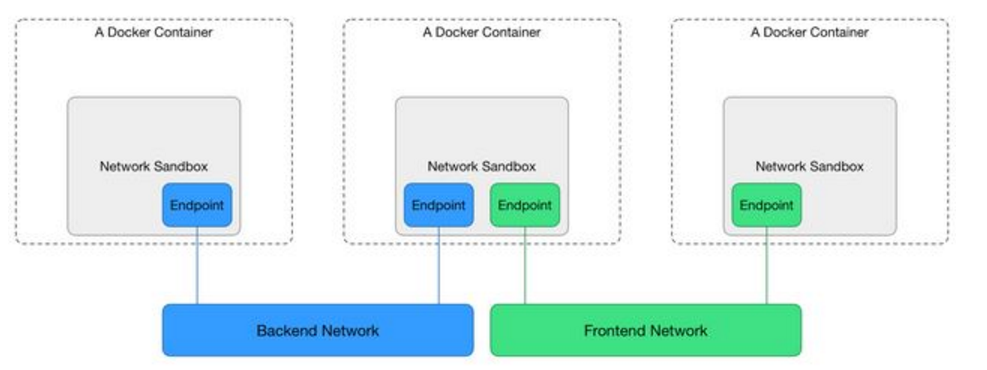
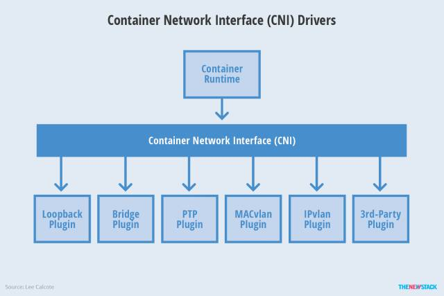

class: center, middle

# 容器网络

&nbsp;
&nbsp;

#### 崔治丞   

主页: https://github.com/CuiZhicheng/slidedemo

---

## 主要内容

### <font color="orangered">容器网络</font>

### CNI与CNM

#### &nbsp; &nbsp; 2.1 CNM
#### &nbsp; &nbsp; 2.2 CNI
#### &nbsp; &nbsp; 2.3 对比

---

## 容器网络

### 容器的特点

#### &nbsp; &nbsp; 轻量级
#### &nbsp; &nbsp; 生命周期短
#### &nbsp; &nbsp; 数量多

---

## 容器网络

### 容器网络 VS 虚拟机网络

#### &nbsp; &nbsp; 1. 虚拟机隔离机制好，虚拟机网卡几乎等同于硬件网卡；容器只是通过namespace在内核中进行隔离，安全性不如虚拟机；
#### &nbsp; &nbsp; 2. 针对安全问题，容器在公有环境下，多部署在虚拟机内部，网络形成多重嵌套；
#### &nbsp; &nbsp; 3. 容器的部署可能在同一物理、虚拟机上，也可能分布在不同机器上；
#### &nbsp; &nbsp; 4. 容器生命周期短，迁移快，网络策略更新及IP管理（IPAM）需要高效；
#### &nbsp; &nbsp; 5. 容器数量很多，多个机器间可能会产生ARP Flooding。

### 容器与应用绑定，不同应用会产生不同场景，需要针对不同的需求制定网络方案。

---

## 容器网络

### 容器网络的发展

#### &nbsp; &nbsp; docker 1.9以前，只支持使用linux bridge+iptables进行single-host的部署，自动化方面也只有pipework这类shell脚本；
#### &nbsp; &nbsp; docker收购容器网络公司socketplane，独立libnetwork，1.9版本开始提供多种网络模式并支持多主机；
#### &nbsp; &nbsp; flannel、weave、calico等多种网络解决方案开始与管理平台集成；
#### &nbsp; &nbsp; CNM与CNI规范的出现

---

## 主要内容

### 容器网络

### <font color="orangered">CNI与CNM</font>

#### &nbsp; &nbsp; 2.1 CNM
#### &nbsp; &nbsp; 2.2 CNI
#### &nbsp; &nbsp; 2.3 对比

---

## CNM

#### &nbsp; &nbsp; CNM（Container Network Model）是Cisco的一位工程师提出的一个容器网络模型。示意图如下：



---

## CNM（Container

#### &nbsp; &nbsp; Sandbox：一个Sandbox对应一个容器的网络栈，能够对该容器的interface、route、dns等参数进行管理。一个Sandbox中可以有多个Endpoint，这些Endpoint可以属于不同的Network。Sandbox的实现可以为linux network namespace、FreeBSD Jail或其他类似的机制。  https://github.com/docker/libnetwork

#### &nbsp; &nbsp; Endpoint： Sandbox通过Endpoint接入Network，一个Endpoint只能属于一个Network，but may only belong to one Sandbox（这句翻译不好）。Endpoint的实现可以是veth pair、Open vSwitch internal port或者其他类似的设备。

#### &nbsp; &nbsp; Network：一个Network由一组Endpoint组成，这些Endpoint彼此间可以直接进行通信，不同的Network间Endpoint的通信彼此隔离。Network的实现可以是linux bridge、Open vSwitch等。

---

## CNM -- Libnetwork

#### &nbsp; &nbsp; NetworkController：每创建一个Network对象时，就会相应地生成一个NetworkController对象，NetworkController对象将Network对象的API暴露给用户，以便用户对libnetwork进行调用，然后驱动特定的Driver对象实现Network对象的功能。NetworkController允许用户绑定Network对象所使用的Driver对象。NetworkController对象可以看做是Network对象的分布式SDN控制器。

#### &nbsp; &nbsp; Network：Network对象是CNM Network的一种实现。NetworkController对象通过提供API对Network对象进行创建和管理。NetworkController对象需要操作Network对象的时候，Network对象所对应的Driver对象会得到通知。一个Network对象能够包含多个Endpoint对象，一个Network对象中包含的各个Endpoint对象间可以通过Driver完成通信，这种通信支持可以是同一主机的，也可以是跨主机的。不同Network对象中的Endpoint对象间彼此隔离。

#### &nbsp; &nbsp; Driver：Driver对象真正实现Network功能（包括通信和管理），它并不直接暴露API给用户。Libnetwork支持多种Driver，其中包括内置的bridge，host，container和overlay，也对remote driver（即第三方，或用户自定义的网络驱动）进行了支持。

---

## CNM -- LibNetwork

#### &nbsp; &nbsp; Endpoint：Endpoint对象是CNM Endpoint的一种实现。容器通过Endpoint对象接入Network，并通过Endpoint对象与其它容器进行通信。一个Endpoint对象只能属于一个Network对象，Network对象的API提供了对于Endpoint对象的创建与管理。

#### &nbsp; &nbsp; Sandbox：Sandbox对象是CNM Sandbox的一种实现。Sandbox对象代表了一个容器的网络栈，拥有IP地址，MAC地址，routes，DNS等网络资源。一个Sandbox对象中可以有多个Endpoint对象，这些Endpoint对象可以属于不同的Network对象，Endpoint对象使用Sandbox对象中的网络资源与外界进行通信。Sandbox对象的创建发生在Endpoint对象的创建后，（Endpoint对象所属的）Network对象所绑定的Driver对象为该Sandbox对象分配网络资源并返回给libnetwork，然后libnetwork使用特定的机制（如linux netns）去配置Sandbox对象中对应的网络资源。

### API
* driver.Config				
* driver.CreateNetwork
* driver.DeleteNetwork		
* driver.CreateEndpoint
* driver.DeleteEndpoint		
* driver.Join
* driver.Leave

---

## Libnetwork

```
func main() {
	networkType := "bridge"

	driverOptions := options.Generic{}
	genericOption := make(map[string]interface{})
	genericOption[netlabel.GenericData] = driverOptions
	controller, err := libnetwork.New(config.OptionDriverConfig(networkType, genericOption))

	network, err := controller.NewNetwork(networkType, "network1", "")
	
	ep, err := network.CreateEndpoint("Endpoint1")

	sbx, err := controller.NewSandbox("container1",
		libnetwork.OptionHostname("test"),
		libnetwork.OptionDomainname("docker.io"))

	err = ep.Join(sbx)

	epInfo, err := ep.DriverInfo()

	macAddress, ok := epInfo[netlabel.MacAddress]

	fmt.Printf("Joined endpoint %s (%s) to sandbox %s (%s)\n", ep.Name(), macAddress, sbx.ContainerID(), sbx.Key())
}
```
---

## CNI

#### &nbsp; &nbsp; CNI（Container Networking Interface）是CoreOS为Rocket（docker之外的另一种容器引擎）提出的一种plugin-based的容器网络接口规范。CNI十分符合Kubernetes中的网络规划思想，Kubernetes采用了CNI作为默认的网络接口规范，目前CNI的实现有Flaanel、Weave、Calico、Romana、Contiv等。  https://github.com/containernetworking/cni

#### &nbsp; &nbsp; CNI没有像CNM一样规定模型的术语，CNI的实现依赖于两种plugin：CNI Plugin负责将容器connect/disconnect到host中的vbridge/vswitch，IPAM Plugin负责配置容器namespace中的网络参数。

#### &nbsp; &nbsp; CNI要求CNI Plugin支持容器的Add/Delete操作

### API

* AddNetworkList
* DelNetworkList


---

## CNI

示意图如下：



---

## CNI -- 配置示例


<figure class="half">
```
$ cat >/etc/cni/net.d/10-mynet.conf <<EOF
{
	"cniVersion": "0.2.0",
	"name": "mynet",
	"type": "bridge",
	"bridge": "cni0",
	"isGateway": true,
	"ipMasq": true,
	"ipam": {
		"type": "host-local",
		"subnet": "10.22.0.0/16",
		"routes": [
			{ "dst": "0.0.0.0/0" }
		]
	}
}
```
```
{
    "name": "frontend",
    "type": "calico",
    "log_level": "DEBUG",
    "etcd_endpoints": "http://162.105.175.30:2379",
    "ipam": {
        "type": "calico-ipam",
        "assign_ipv4": "true",
        "assign_ipv6": "true",
        "ipv4_pools": ["10.0.0.0/24", "20.0.0.0/16"],
        "ipv6_pools": ["2001:db8::1/120"]
    }
}
```
</figure>

---

## CNI -- Calico

```
{
    "name": "frontend",
    "type": "calico",
    "log_level": "DEBUG",
    "etcd_endpoints": "http://162.105.175.30:2379",
    "ipam": {
        "type": "calico-ipam",
        "assign_ipv4": "true",
        "assign_ipv6": "true",
        "ipv4_pools": ["10.0.0.0/24", "20.0.0.0/16"],
        "ipv6_pools": ["2001:db8::1/120"]
    }
}
```

---

## CNM与CNI对比


---

## 插图

** Ada Lovelace **


---

## `\(\LaTeX{}\)` in remark


1. This is an inline integral: `\(\int_a^bf(x)dx\)`
2. More `\(x={a \over b}\)` formulae.

Display formula:

$$e^{i\pi} + 1 = 0$$

---

class: center, middle

# 谢谢
