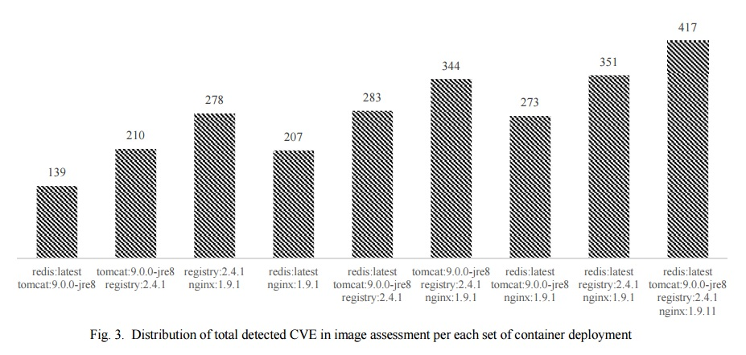

class: center, middle

# Quantitative Risk Assessment of Container Based Cloud Platform
#### IEEE Conference on Applicatoin, Information and Network Security(AINS)
###### Ehsan Mostajeran, Mohd Nizam Mohd Mydin, Mohammad Fairus Khalid, Bukhary Ikhwan Ismail, Rajendar Kandan and Ong Hong Hoe
###### Advanced Computing Lab, MIMOS Berhad, Kuala lumpur, Malaysia 

&nbsp;
&nbsp;

#### 崔治丞   

主页: https://github.com/CuiZhicheng/slidedemo

---

## 动机

容器被部署在共享的内核上，导致容器的脆弱性（vulnerabilities）和安全风向（security risk）会影响到云平台和应用（neighboring application）。例如，容器内对内存的频繁读写可导致越权，在只读部分写入数据。

Docker已经提出了一些容器弱点，云平台也需要自动检测容器脆弱性的工具，但随着安全属性的变化，容器的自动化部署过程也越来越难以进行检测。

#### 安全风险管理（Security Risk Management）
* 识别和管理平台和服务面对的威胁
* 在容器部署的各个阶段快速识别威胁
* 定量分析平台风险

---

## 目标

#### 风险评估框架（Risk Assessment Framework）
* 对主机和仓库内的image、部署的服务、容器配置进行分析
* 为容器安全提供测试（benchmark）
* 提供定量风险评估数据

---

## 预备知识

#### Common Vulnerability and Exposures (CVE)
CVE字典是公开披露的安全漏洞和风险，是免费的搜索，使用，并纳入产品和服务

#### Common Vulnerability Scoring System (CVSS) 
CVSS提供了一个开放的框架，即“通用漏洞评分系统”，是一个“行业公开标准，其被设计用来评测漏洞的严重程度，并帮助确定所需反应的紧急度和重要度”。

主要目的是帮助人们建立衡量漏洞严重程度的标准，使得人们可以比较漏洞的严重程度，从而确定处理它们的优先级。CVSS得分基于一系列维度上的测量结果，这些测量维度被称为量度（Metrics）。漏洞的最终得分最大为10，最小为0。

#### Common Platform Enumeration (CPE)
CPE是信息技术系统、软件和软件包的结构化命名方案。基于统一资源标识符（URI）的通用语法，CPE包括正式名称格式、对系统进行名称检查的方法以及将文本和测试绑定到名称的描述格式。

---

## 预备知识

#### Security Content Automation Protocol (SCAP)
SCAP由NIST（National Institute of Standards and Technology：美国国家标准与技术研究院）提出，是比较成熟的一套信息安全评估标准体系。
CVE和CVSS是SCAP的元素（component）

####  National Vulnerability Database (NVD)

NVD是美国政府基于标准的漏洞管理的数据仓库，使用SCAP。这些数据能够支持漏洞管理、安全评估的自动化。CPE是NVD的重要组成部分，通过CPE，可以知道容器安全风险会对哪些软件造成影响。

---

## 架构

框架对三个部分进行风险分析：

* container stack applied configurations
* images
* deployed services

#### 架构如下：

---

## 测量方式（Metrics）

1. CVE

2. CPE

3. CVSS

4. Security Configuration Benchmark：    主要基于Docker和K8s的benchmark

---

## 镜像评估（Image Assessment）

容器镜像都是分层的（Layered Structure），每一层都会产生威胁

框架对仓库和拉取到本地的所有镜像的每一层进行扫描，与CVE进行对比

通过CVSS，获取base，temporal，environmental三个分数，表示随着时间和用户环境变化的风险和原始特性。

组合得到可利用性分数和影响得分，表示该风险是否容易被利用及被利用后可能造成的风险。

再通过综合计算得到该镜像的风险得分。

---

## 配置评估（Configuration Assessment）

1. 容器部署及运行中的容器的配置必须进行动态检查。
2. 多租户场景下，容器的每一项配置都需要对其脆弱性及可能的错误配置进行分析。

使用改良的benchmark对宿主机操作系统、编排、容器后台（daemon）及运行中的容器配置进行检测。并结合likehood和impact给出分数

最终的风险得分： 

---

## 服务评估（Service Assessment）

运行在容器内的服务，会想其他服务暴露端口，可能会产生威胁。

可以通过CPE查询该服务会受到哪些CVE的威胁。

---

## 结果

#### 不同服务组合的CVE数量

---

## 结果

##### 不同服务组合的各项得分

---

## 感想

* 容器安全的相关协议、工具等
* 容器安全的主要影响因素
* 容器安全的分析评估方法